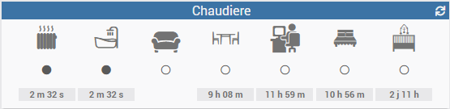

# jeedom_widget_v4
Mes widgets Jeedom

Je n'ai pas trouvé dans les templates de bases le widget que j'avais besoin.
Je me suis donc décidé à customiser un widget (en m'appuyant sur la doc Jeedom)

## Widget d'info binaire contenant l'icone de l'info et sa valeur

Voici ce que donne cela donne en image

Le code est disponible ici : [commandIconAndValueIcon](./dashboard/cmd.info.binary.commandIconAndValueIcon.html)

Si l'on ne veut pas afficher le "time widget", il faut ajouter un paramètre au widget.

|Parametre|valeur|Aperçu|Description|
|-|-|-|-|
|timeWidget|on/off|on :  off : |haut (on/off) : icone de l'info milieu (on/off) : icone On/Off bas (on) : le temp écoulé|
|tagIconName|string (ex :`<i class='...'></i>`)||la balise contenant l'icone de remplacement de la commande|
|commandName|string (ex : Etat)||Le nom de la commande a afficher|
|iconOn|string (ex :`<i class='...'></i>`)||la balise contenant l'icone a afficher la valeur est vraie.  (par défaut :`<i class='fas fa-circle'></i>`)|
|iconOff|string (ex :`<i class='...'></i>`)||la balise contenant l'icone a afficher la valeur est fausse.  (par défaut :`<i class='far fa-circle'></i>`)|

## Installation et affectation du widget

La procédure est détaillée ici : [Procédure d'installation](./doc/InstallationProcedure.md)