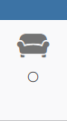

# jeedom_widget_v4
Mes widgets Jeedom

Je n'ai pas trouvé dans les templates de bases le widget que j'avais besoin.
Je me suis donc décidé à customiser un widget (en m'appuyant sur la doc Jeedom)

## Widget d'info binaire contenant l'icone de l'info et sa valeur

Voici ce que donne cela donne en image

Le code est disponible ici : [cmdIconAndValue.html](./dashboard/cmd.info.binary.icon-cmdIconAndValue.html)

Si l'on ne veut pas afficher le "time widget", il faut ajouter un paramètre au widget.

|Parametre|valeur|Aperçu|Description|
|-|-|-|-|
|timeWidget|on||haut : icone de l'info milieu : icone On/Off bas : le temp écoulé|
|timeWidget|off||haut : icone de l'info milieu : icone On/Off bas : espace vide|

## Installation et affectation du widget

La procédure est détaillée ici : [Procédure d'installation](./doc/InstallationProcedure.md)