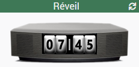

# Widget Réveil (Jeedom v4)
Widget permettant d'afficher une image indiquant l'heure de réveil.

Il faut transmettre au widget une date (chaine de caractères) au format FR "jj/mm/aaaa hh:mi:ss". Si l'heure de réveil est bien future et active dans les prochaines 24h alors cette dernière est indiquée sur l'écran.

Voici ce que donne cela donne en image  

## Le script
- [Dashboard/Mobile : alarmClock](./cmd.info.string.alarmClock.html)

## Installation

### Copier le script
Recopier le script dans le répertoire `	/var/www/html/data/customTemplates/dashboard/cmd.info.string.alarmClock.html`  
Pour la version mobile remplacer dashboard par mobile.

ou créer un nouveau script ayant les caractéristique suivante :
|Nom|Valeur|
|-|-|
|Version|Dashboard ou Mobile|
|Type|Info|
|Sous-type|Autre|
|Nom|Hygrometer (par exemple)|
et recopier le contenu du fichier `cmd.info.string.alarmClock.html`

### Copier les images

## Les images
Il faut recopier les images dans `/var/www/html/data/img` soit en les copiants sur le serveur, ou en utilisant l'interface.

## Les paramètres (tous optionnels)

|Parametre|version|valeur|Aperçu|Description|
|-|-|-|-|-|
|ratio|Dashboard|[0.5-1.5] (px)||Permet d'agrandir ou réduire l'image. Valeur par défaut "1"|
|ratioMobile|Mobile|[0.5-1.5] (px)||idem. Sauf la valeur par défaut "0.75"|