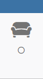

# Widget d'info binaire contenant l'icone de l'info et sa valeur (Jeedom v4)
Widget permettant d'afficher l'icône de la commande et en dessous un icône on/off.

Voici ce que donne cela donne en image

## Le script
- [Dashboard/Mobile : commandIconAndValueIcon](./cmd.info.binary.commandIconAndValueIcon.html)

## Installation
Recopier le script dans les répertoires `/var/www/html/data/customTemplates/dashboard/` et `/var/www/html/data/customTemplates/mobile/`

Remarque pour la version mobile, il est possible de faire un lien symbolique pointant vers la version sahboard pour éviter de déployer 2 fois la même version : 
Dans ce cas on copie juste le script dans le répertoire : `/var/www/html/data/customTemplates/dashboard/` 
 Commande pour créer le lien : `sudo ln -s /var/www/html/data/customTemplates/dashboard/cmd.info.binary.commandIconAndValueIcon.html /var/www/html/data/customTemplates/mobile/cmd.info.binary.commandIconAndValueIcon.html` 
Commande pour changer le propriétaire du lien (comme les autres fichiers) :
`sudo chown -h www-data:www-data /var/www/html/data/customTemplates/mobile/cmd.info.binary.commandIconAndValueIcon.html`

ou créer manuellement un nouveau script ayant les caractéristique suivante :
|Nom|Valeur|
|-|-|
|Version|Dashboard ou Mobile|
|Type|Info|
|Sous-type|Binaire|
|Nom|CommandIconAndValueIcon (par exemple)|
et recopier le contenu du fichier.

## Les paramètres (tous optionnels)

|Parametre|version|valeur|Aperçu|Description|
|-|-|-|-|-|
|timeWidget|Dashboard|on/off (par défaut on)|on :  off : |haut (on/off) : icone de l'info milieu (on/off) : icone On/Off bas (on) : le temp écoulé|
|timeWidgetMobile|Mobile|on/off (par défaut off)|idem|idem sauf valeur par défaut "off"|
|tagIconName|Dashboard Mobile|string (ex :`<i class='...'></i>`)||la balise contenant l'icone de remplacement de la commande|
|iconColor|Dashboard Mobile|string||le code ou le nom de la couleur à appliquer (ex : "blue, "#0000FF")|
|commandName|Dashboard Mobile|string (ex : Etat)||Le nom de la commande a afficher|
|iconOn|Dashboard Mobile|string (ex :`<i class='...'></i>`)||la balise contenant l'icone a afficher la valeur est vraie.  (par défaut :`<i class='fas fa-circle'></i>`)|
|iconOff|Dashboard Mobile|string (ex :`<i class='...'></i>`)||la balise contenant l'icone a afficher la valeur est fausse.  (par défaut :`<i class='far fa-circle'></i>`)|
