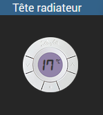
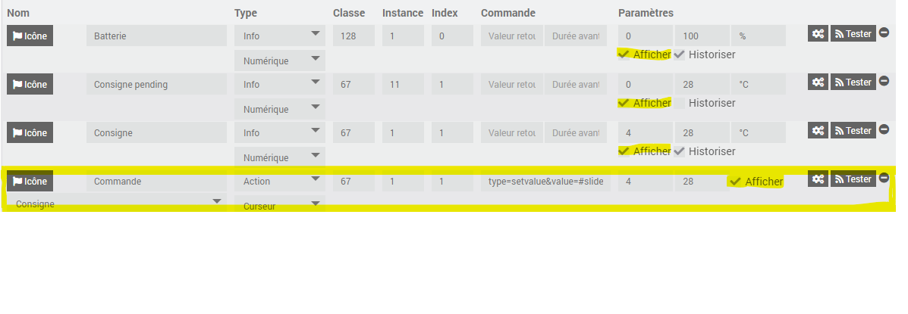
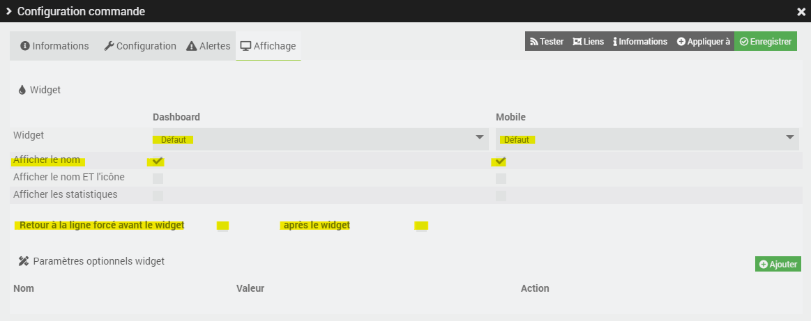
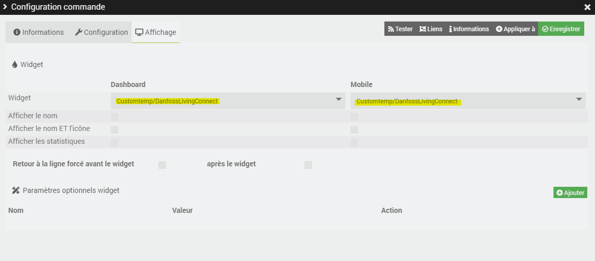

# Widget Danfoss Living Connect (Jeedom v4)
Widget permettant d'afficher l'image d'une tête Danfoss LC13 et de piloter la température en cliquant sur les boutons (gauche et droite).
Le % de batterie s'affiche aussi en cliquant sur le bouton du bas.

Voici ce que donne cela donne en image  

## Le script
- [Dashboard/Mobile : danfossLivingConnect](./cmd.action.slider.danfossLivingConnect.html)

## Installation

### Copier le widget
Recopier le script dans le répertoire `/var/www/html/data/customTemplates/dashboard/cmd.action.slider.danfossLivingConnect.html`
Recopier le répertoire `cmd.action.slider.danfossLivingConnect` (et son contenu) dans le répertoire `/var/www/html/data/customTemplates/dashboard/`.

Pour la version mobile recopier uniquement le script dans le répertoire mobile `/var/www/html/data/customTemplates/mobile/cmd.action.slider.danfossLivingConnect.html`
Les images et polices sont récupérer du dashboard.
Il est possible de faire un lien symbolique pour ne pas avoir a recopier le fichier.
 Commande pour créer le lien :
 `sudo ln -s /var/www/html/data/customTemplates/dashboard/cmd.action.slider.danfossLivingConnect.html /var/www/html/data/customTemplates/mobile/cmd.action.slider.danfossLivingConnect.html`
Commande pour changer le propriétaire du lien (comme les autres fichiers) :
 `sudo chown -h www-data:www-data /var/www/html/data/customTemplates/mobile/cmd.action.slider.danfossLivingConnect.html`

ou créer un nouveau script ayant les caractéristique suivante :
|Nom|Valeur|
|-|-|
|Version|Dashboard ou Mobile|
|Type|Action|
|Sous-type|Curseur|
|Nom|danfossLivingConnect (par exemple)|
et recopier le contenu du fichier `cmd.info.numeric.hygrometer.html`

## Configuration

Il faut appliquer le widget `danfossLivingConnect` sur la commande `Commande` de type Action.

Pour que le widget fonctionne, il faut impérativement afficher et appliquer le widget `Default` sur les commandes suivantes :
- Consigne
- Consigne Pending
- Batterie

Attention, les commandes (Consigne, consigne pending et Batterie) doivent être afficher avant la commande `Commande`.

Il faut glisser les lignes des commandes et enregistrer l'objet.

Voici un exemple d'ordre qui fonctionne :

Pour les 3 premières commandes (qui seront masqué par le widget mais nécessaire pour récupérer les valeurs), il faut applique le plugin Défaut et cocher afficher le nom et surtout décocher les retours à la ligne forcé:

Pour la ligne correspondant à la commande, il faut juste sélectionner le widget :

