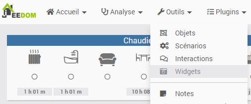
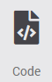
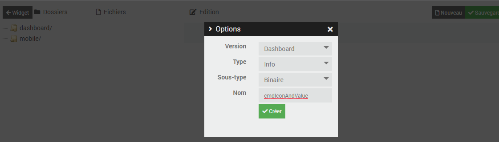
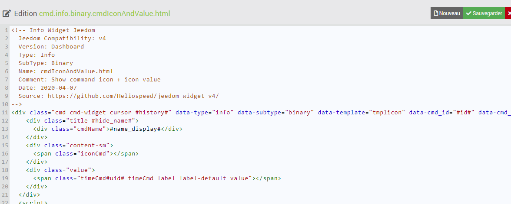
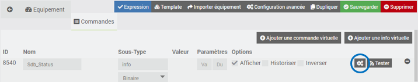
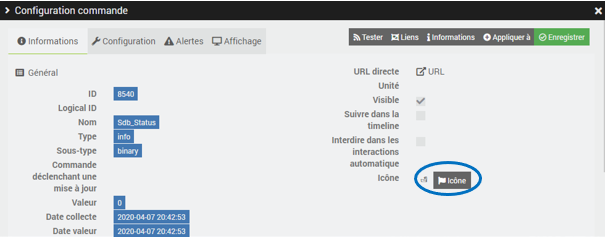
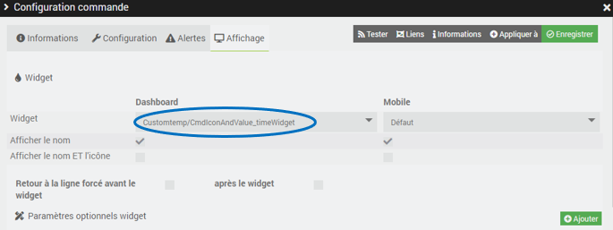
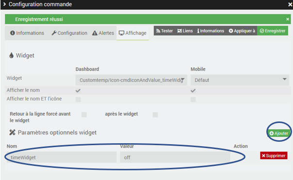
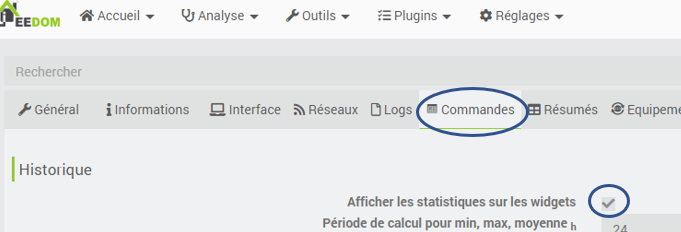

# Procédure d'installation d'un widget Jeedom v4 (Core)

## Installation d'un widget
Via l'interface de Jeedom, il faut aller sur Outils puis Widgets

Ensuite, il faut cliquer sur l'icone Code :  
 

Dans l'écran suivant cliquer sur nouveau, puis renseigner le formulaire de création :  
Selectionner les paramètres correspondant au type de widget par exemple -> Dashboard ; Type -> Info ; Sous-Type -> Binaire ; Nom -> le nom du widget
 

Dans l'écran suivant, recopier le code et cliquer sur sauvegarder :  
 

L'installation est terminée

## Affectation d'un widget

Une fois les fichiers recopiés, il faut les appliquer.
Pour cela aller sur l'équipement souhaité et cliquer sur l'icone engrenages :

Dans l'onglet Informations, c'est ici que l'on définit l'icône de la commande :

Dans l'onglet Affichage, c'est ici que l'on sélectionne le widget a appliquer (affectation du widget CustomTemp/nomDuWidget) :

## Ajout d'un paramètre

S'il faut ajouter un paramètre, c'est aussi dans l'onglet Affichage dans la partie Paramètres optionnels widget, il faut cliquer sur Ajouter et ensuite renseigner le nom du paramètre et sa valeur :  

## Activer les stats des widgets
Si vous n'avez pas l'option de disponible, il faut l'activer en allant dans Réglages/Système/Configuration. Il faut ensuite sélectionner l'onglet Commandes puis cocher 'Afficher les statistiques sur les widgets'

