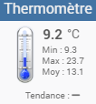
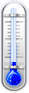
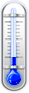
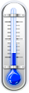
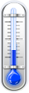
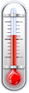
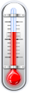
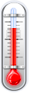
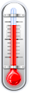
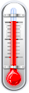

# Widget Thermomètre (Jeedom v4)
Widget permettant d'afficher une image d'un thermomètre et à côté la température + (stats).

Voici ce que donne cela donne en image  

## Le script
- [Dashboard/Mobile : thermometer](./cmd.info.numeric.thermometer.html)

## Les images
Il faut recopier les images dans `/var/www/html/data/img` soit en les copiants sur le serveur, ou en utilisant l'interface.

|Plage de température °C|  <0&nbsp;&nbsp;&nbsp;|>00 et <=05|>05 et <=10|>10 et <=13|>13 et <=16|>16 et <=18|>18 et <=20|>20 et <=22|>22 et <=24|>24 et <=26|>26 et <=28|>28 et <=34|  >34&nbsp;|
|-:|:-:|:-:|:-:|:-:|:-:|:-:|:-:|:-:|:-:|:-:|:-:|:-:|:-:|
|Images||||||||||||||

## Les paramètres (tous optionnels)

|Parametre|version|valeur|Aperçu|Description|
|-|-|-|-|-|
|largeurDashboardPx|Dashboard|[20-29] (px)||Permet d'agrandir la largeur de l'image jusqu'à sa resolution maxi. La valeur par défaut est "20" px|
|largeurMobilePx|Mobile|[20-29] (px)||idem|